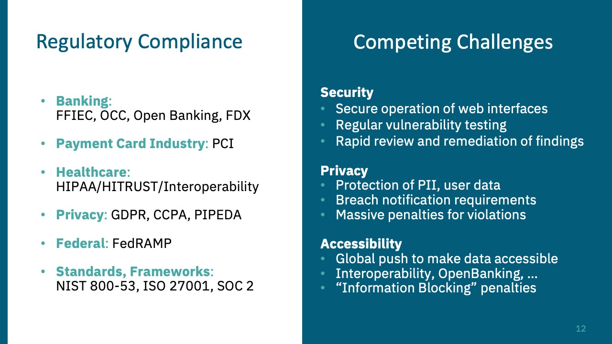

# API-Security-Fundamentals
APISEC University API Security Fundamentals Course

## Introduction to API Security
### Why API Security
- API
	* DIrect access to sensitive data
	* Often over-permissioned
	* Vulnerable to logic flaws
- API attack find vulnerability -> Breach no need for the full attack kill chain
- <figure>  </figure>

## OWASP API Security Top 10 
### API1 Broken Object Level Authorization BOLA
- Attacker authenticate as user A and retrieves data from user B.

### API2 Broken Authentication
- Missing or Poorly implemented security controls. (vuln to brute force, token expiration, password storage, rate limitation, .... )

### API3 Borken Object Property Level Authorization
- mirge of (Mass assignment and excessive data exposure)
- Ability to modify records, revealing protected data

### API4 Unrestricted Resource Consumption
- Denial of service, Performance impact, Excessive operations in a single request.
- Implement traffic controls, Test effectiveness of controls.

### API5 Broken Function Level Authorization BFLA
- Abuse of API functionality to improperly modify objects (create, update, delete) could be using methods like GET, PUT, DELETE.

### API6 Unrestricted Access to Sensitive Business Flows
- Abuse of legitimate business workflow through excessive, automated use.
- Typlically a result of application logic flaw ex. Mass automated ticket purchasing.

### API7 Server Side Request Forgery
- Exploiting URL inputs to make a request to a malicious 3rd party server.

### API8 Security Misconfiguration
- Generally lack of hardening, unnecessary features enabled.

### API9 Improper Inventory Managment
- Unathorized API access via old unused API versions, or through trusted 3rd parties.

### API10 Unsafe Consumption of APIs
- Exposure occurs visa use of 3rd parties APIs. You need to validate data coming from 3rd parties